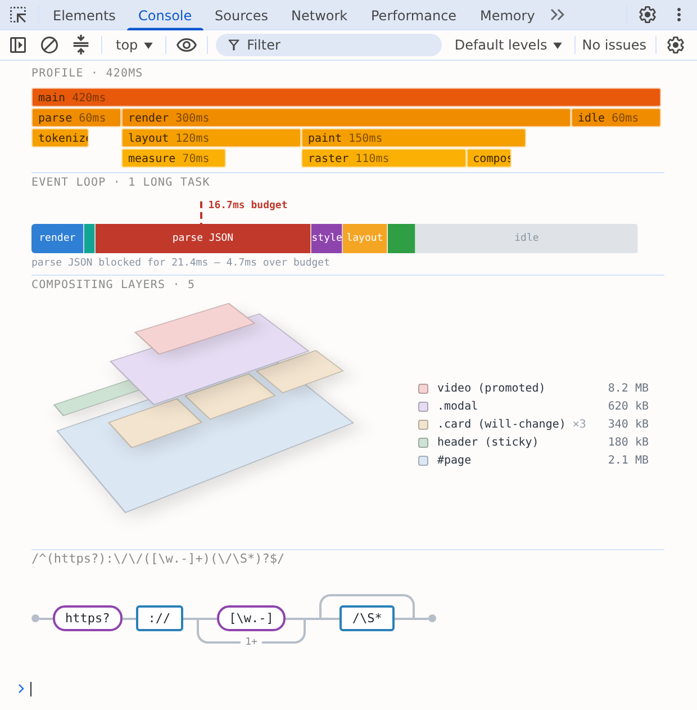
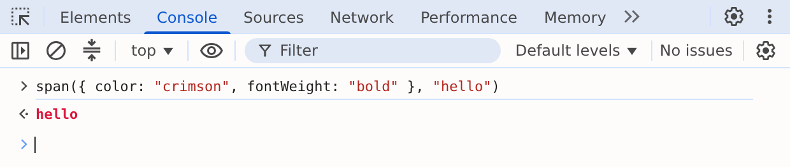
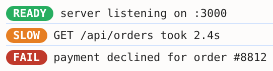
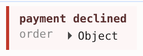
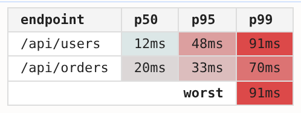

# consolepro

Rich, styled content in the Chrome and Edge devtools console.



Every one of those is a `console.log`. There are more in the [gallery](docs/gallery.md).

## Where this comes from

`console.log` can already do some of this on its own. The top bar of that flame graph is one `%c`:

```js
console.log("%cmain %sms", "background: #e8590c; color: #3d2600; padding: 0 5px", 420);
```

Each `%c` takes its CSS from the next argument and styles the text that follows it. That holds together for a single bar. The row underneath it is three bars, and all of them have to go into the same call:

```js
console.log("%cparse %sms%c %crender %sms%c %cidle %sms",
  bar, 60, "", bar, 300, "", bar, 60);
```

Each `""` is there to switch the styling back off before the next bar starts.

You can wrap this up, and people do: a `bar(label, css)` that returns the fragment and its CSS, and a `log` helper that joins the fragments and flattens the arguments. That part is fine.

What you can't do is nest one inside another. A `%c` changes the styling from that point in the text onward, so a message comes out as a flat run of styled spans. There is no row to put bars in, and no panel to put rows in.

The bars would come out the wrong size anyway. A `%c` only honours a handful of CSS properties, and `width` is not one of them, so `parse` and `render` are as wide as their labels rather than as their share of the 420ms. Padding the text fakes it but only up to a point.

Enter [custom formatters][spec], an API that shipped with Chrome in 2015 and lets a value say how it should appear in the console. A ClojureScript map or an Immutable.js list can print as itself instead of as its internals. A formatter hands devtools an HTML element structure, without the `%c` restrictions.

consolepro leverages that API for logging rather than for data types. You build a message out of HTML and CSS that behaves the way it does everywhere else.

[spec]: docs/chrome-custom-formatters.md

## Turn it on

Custom formatters ship in Chrome and Edge, but behind a setting. Open devtools, then **Settings → Console → Enable custom formatters**, and reload the page. Nothing renders until you do.

## Tags are functions

What consolepro renders is HTML, written as function calls rather than as markup. Every tag is a function: `span("hello")` is a `<span>`, and `console.log` renders it.

The first argument is the attributes when it is a plain object, and a child otherwise. Attributes are CSS properties, written flat.

```js
import { div, span } from "consolepro";

console.log(span("hello"));
console.log(span({ color: "crimson", fontWeight: "bold" }, "hello"));
console.log(span({ height: "1px", background: "#ccc" }));  // attributes, no children
```



Every remaining argument is exactly one child, whatever its type. Arrays don't flatten, so an array is logged as itself.

```js
span("a", 42, div("b"))        // strings, numbers, other calls
span(...items)                 // spread a list into children
span(items)                    // the array itself
span(cond ? span("x") : null)  // null and undefined are dropped
```

The formatters API renders seven tags: `div`, `span`, `ol`, `li`, `table`, `tr` and `td`. Everything else is built out of those, so `h1` is a `div` with the right styles on it and `img` is a `div` with a background image.

## Build your own

A call gives you back an ordinary value, so you can wrap one in a function and reuse it the way you would any other helper.

```js
const badge = (text, color) => span({
  color: "white", background: color, fontWeight: "bold",
  padding: "1px 7px", borderRadius: "10px", fontSize: "11px",
}, text);

console.log(span(badge("READY", "#27ae60"), " server listening on :3000"));
console.log(span(badge("SLOW", "#e67e22"), " GET /api/orders took 2.4s"));
```



`extend` does the same for attributes, giving you a tag with defaults already applied:

```js
const box = td.extend({ padding: "3px 10px" });
const head = box.extend({ fontWeight: "bold" });
```

Set a colour whenever you set a background. Text inherits the console's, and that flips with the devtools theme.

## Objects stay live

An object logged inside a message stays inspectable. It is a reference to the real thing rather than a snapshot of its text, so you can open it in the console and walk it. It arrives collapsed, as `▸ Object`.

```js
const order = { id: 8812, total: 42.5, items: ["hat", "scarf"] };

console.log(
  div({ padding: "6px 10px", borderLeft: "3px solid #c0392b",
        background: "#fdf6f6", color: "#5a2f2f" },
    div({ fontWeight: "bold" }, "payment declined"),
    div(span({ color: "#8a8a8a" }, "order "), order),
  ),
);
```



An object in the *first* argument is read as attributes, since that slot is taken. Pass empty attributes to put one there: `span({}, order)`.

## Grids

`grid` lays cells out with CSS grid, which is how you get cells that span. The column count comes from the first row, so it is not written down twice.

```js
const { row, cell } = grid;
const box = cell.extend({ padding: "3px 10px", background: "white" });
const head = box.extend({ fontWeight: "bold", background: "#f4f4f4" });
const heat = (n) => box({ textAlign: "right",
  background: `rgb(220, ${255 - n * 2}, ${255 - n * 2})` }, n + "ms");

console.log(
  grid({ gap: "1px", background: "#ddd", border: "1px solid #ddd" },
    row(head("endpoint"), head("p50"), head("p95"), head("p99")),
    row(box("/api/users"), heat(12), heat(48), heat(91)),
    row(box("/api/orders"), heat(20), heat(33), heat(70)),
    row(box({ colspan: 3, fontWeight: "bold", textAlign: "right" }, "worst"), heat(91)),
  ),
);
```



`colspan` and `rowspan` are named after the table attributes they stand in for, and become `grid-column` and `grid-row`. A cell covered by a `rowspan` above is left out of its row, the same as in HTML.

Each row's spans have to add up to the column count. When they don't, the cells after the mistake shift along and the last row comes out ragged. It renders, so it is worth a glance rather than an error.

## Where to go next

Thirty worked examples in the [gallery](docs/gallery.md), from a session log to a flame graph to a layer inspector tilted in 3D. Every one of them is a `console.log`.

## Status

Early. The function API above works; the HTML string API doesn't exist yet. There's no build step and nothing is published.

## Licence

MIT
