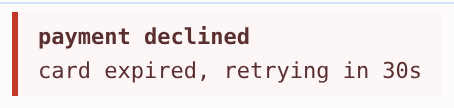

# consolefmt

Rich, styled content in the devtools console.

> [!WARNING]
> **Deprecated as of Chrome 153 (September 2026).** consolefmt is no longer maintained.
>
> For eleven years, custom formatters rendered inline styles verbatim, which is what let this library lay out real CSS in the console. Chrome 153 ended that. Formatter styles now go through the same CSS allowlist as `console.log("%c", …)`, which drops layout properties like `display`, so the gallery examples no longer render as shown.
>
> This is [intentional security hardening](https://github.com/ChromeDevTools/devtools-frontend/commit/7b4274862eca451a4ba82299cf271c8d7578cc37) against a page restyling the DevTools UI, with no opt-out (no flag, experiment, or policy). Firefox filters formatter styles too — with a [broader allowlist](https://firefox-source-docs.mozilla.org/devtools-user/custom_formatters/) that still drops grid, flex, and transforms.


Every one of those is a `console.log`, and there are plenty more in the [gallery](docs/gallery.md). Run them in your own console on the [playground](https://aadsm.github.io/consolefmt/).

## Origin story

`console.log` can already do some of this on its own. Each `%c` takes its CSS from the next argument and styles the text that follows it. The top bar of that flame graph is one `%c`:

```js
console.log("%cmain %sms", "background: #e8590c; color: #3d2600; padding: 0 5px", 420);
```

That works for a single bar, but the row underneath it is three bars, and they all go into the same format string, each with a `""` after it to switch the styling back off:

```js
console.log("%cparse %sms%c %crender %sms%c %cidle %sms",
  bar, 60, "", bar, 300, "", bar, 60);
```

You can build helpers that make `%c` easier to use, but you still can't nest one inside another. A `%c` changes the styling from that point on, so a message comes out as a flat run of styled spans. There is no row to put bars in, and no panel to put rows in.

The sizes would be wrong anyway: a `%c` only honours a handful of CSS properties, and `width` is not one of them, so the bars come out as wide as their labels. Padding fakes it but only up to a point.

Enter [custom formatters][spec], an API that shipped with Chrome in 2015 and lets a value say how it should appear in the console. A ClojureScript map or an Immutable.js list can print as itself instead of as its internals. A formatter returns an HTML element structure, without the `%c` restrictions.

consolefmt leverages that API for logging rather than for data types. You build a message out of HTML and CSS that renders the way you expect it to.

[spec]: docs/chrome-custom-formatters.md

## Enable custom formatters

Custom formatters work in Chromium browsers and Firefox, but behind a setting. Once per browser: open devtools, then **Settings → Enable custom formatters**, and reload the page. Nothing renders until you do.

## Install

From npm:

```
npm install consolefmt
```

```js
import consolefmt from "consolefmt";
```

Or from a CDN, without a build step:

```html
<script type="module">
  import consolefmt from "https://cdn.jsdelivr.net/npm/consolefmt@1/dist/consolefmt.esm.js";
</script>
```

Or as a classic script, which defines a `consolefmt` global:

```html
<script src="https://cdn.jsdelivr.net/npm/consolefmt@1/dist/consolefmt.js"></script>
<script>
  console.log(consolefmt.span({ color: "crimson" }, "hello"));
</script>
```

Both builds are minified, and their sourcemaps carry the TypeScript, so consolefmt's own frames read as source in devtools.

## Your first message

For every HTML tag consolefmt provides a function that returns an object the console renders as that element:

```js
const { span } = consolefmt;

console.log(span({ color: "crimson", fontWeight: "bold" }, "hello"));
```


A call takes a plain object of CSS properties first, then its children. Anything else in first position is a child too, so `span("hello")` works without passing an empty object first.

## Messages nest

Every argument after the attributes is a child, and a child can be another element. That is how a message becomes more than a line.

```js
const { div } = consolefmt;

console.log(
  div({ padding: "6px 10px", borderLeft: "3px solid #c0392b",
        background: "#fdf6f6", color: "#5a2f2f" },
    div({ fontWeight: "bold" }, "payment declined"),
    div({ marginTop: "4px" }, "card expired, retrying in 30s"),
  ),
);
```



## Build your own elements

Wrap a structure in a function and you have an element of your own, usable like any other.

```js
const { span } = consolefmt;

const badge = (text, color) => span({
  color: "white", background: color, fontWeight: "bold",
  padding: "1px 7px", borderRadius: "10px", fontSize: "11px",
}, text);

console.log(span(badge("READY", "#27ae60"), " server listening on :3000"));
console.log(span(badge("SLOW", "#e67e22"), " GET /api/orders took 2.4s"));
```


`extend` does the same for attributes, giving you a tag with defaults already applied:

```js
const box = td.extend({ padding: "3px 10px" });
const head = box.extend({ fontWeight: "bold" });
```

## Log the object itself

An object inside a message stays live. It is a reference to the real thing rather than a snapshot of its text, so you can open it in the console and walk it. It arrives collapsed, as `▸ Object`.

```js
const { div, span } = consolefmt;

const badge = (text, color) => span({
  color: "white", background: color, fontWeight: "bold",
  padding: "1px 7px", borderRadius: "10px", fontSize: "11px",
}, text);

const order = { id: 8812, total: 42.5, items: ["hat", "scarf"] };

console.log(
  div({ padding: "6px 10px", borderLeft: "3px solid #c0392b",
        background: "#fdf6f6", color: "#5a2f2f" },
    div(badge("FAIL", "#c0392b"),
        span({ fontWeight: "bold" }, " payment declined")),
    div({ marginTop: "4px" }, span({ color: "#8a8a8a" }, "order "), order),
  ),
);
```


An object in the *first* argument is read as attributes. Pass empty attributes to put one there: `span({}, order)`.

## Grids

`grid` is a thin layer over `display: grid`, for building tables whose cells span. The formatters API renders `table`, `tr` and `td`, but ignores `colspan` and `rowspan`, so a real table cannot span its cells.

```js
const { grid } = consolefmt;
const { row, cell } = grid;
const box = cell.extend({ padding: "3px 10px", background: "white" });
const head = box.extend({ fontWeight: "bold", background: "#f4f4f4" });
const heat = (n) => box({ textAlign: "right",
  background: `rgb(220, ${255 - n * 2}, ${255 - n * 2})` }, n + "ms");

console.log(
  grid({ gap: "1px", background: "#ddd", border: "1px solid #ddd" },
    row(head("endpoint"), head("p50"), head("p95"), head("p99")),
    row(box("/api/users"), heat(12), heat(48), heat(91)),
    row(box("/api/orders"), heat(20), heat(33), heat(70)),
    row(box({ colspan: 3, fontWeight: "bold", textAlign: "right" }, "worst"), heat(91)),
  ),
);
```


`colspan` and `rowspan` are named after the table attributes they stand in for, and become `grid-column` and `grid-row`. A cell covered by a `rowspan` above is left out of its row, the same as in HTML.

## Where to go next

Thirty worked examples in the [gallery](docs/gallery.md), from a session log to a flame graph to a layer inspector tilted in 3D. Every one of them is a `console.log`, and the [playground](https://aadsm.github.io/consolefmt/) runs any of them in your own console without installing anything.

## Licence

MIT
